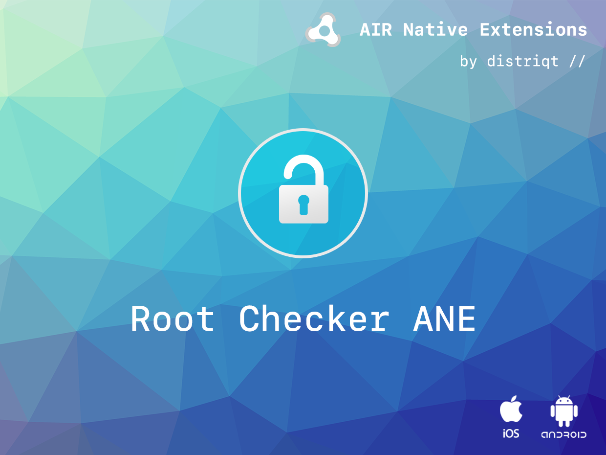

built by [distriqt //](https://airnativeextensions.com) 



# RootChecker

The [RootChecker](https://airnativeextensions.com/extension/com.distriqt.RootChecker) extension 
gives you the ability to check whether the current device has been "rooted".


### Features

- Check for root access (jail broken device)


## Documentation

The [documentation site](https://docs.airnativeextensions.com/docs/rootchecker/) forms the best source of detailed documentation for the extension along with the [asdocs](https://docs.airnativeextensions.com/asdocs/rootchecker/). 


Quick Example: 

```as3
if (RootChecker.instance.isRooted)
{
    // device has been rooted / jail broken 
}
```

More information here: 

[com.distriqt.RootChecker](https://airnativeextensions.com/extension/com.distriqt.RootChecker)


## License

You can purchase a license for using this extension:

[airnativeextensions.com](https://airnativeextensions.com/)

distriqt retains all copyright.


